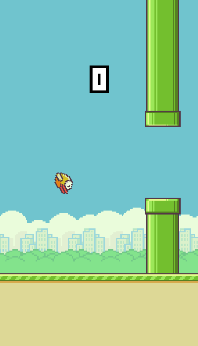

# 🐤 slappyFwift

> Flap Flap Birdy

<p align="center">
  
</p>

---

## NOTE ✋ ⚠️ This uses Swift 2.3, use it for reference purpose, upgrading to Swift 3 is planned for future

---

## 🚀 Getting Started

* ``` git clone https://github.com/ragmha/slappyfwift.git```

* ```Open the file on Xcode```

* ```Compile & Run! 🚀```


## License
[MIT](./license) © [Raghib Hasan](http://raghibm.com/)
